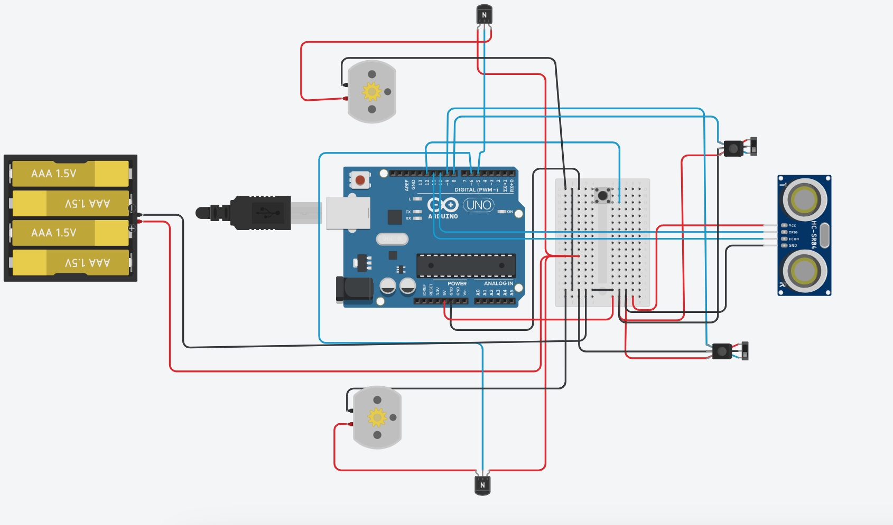

# Robo Linha
## Robo seguidor de linha com sensor de IR e Ultrassom
### Projeto de Bloco de Robótica - INFNET

[https://www.tinkercad.com/things/elk2yoNNw5u-robo-seguidor-de-linha-com-sensores-ir-e-ultrassom](https://www.tinkercad.com/things/elk2yoNNw5u-robo-seguidor-de-linha-com-sensores-ir-e-ultrassom)
